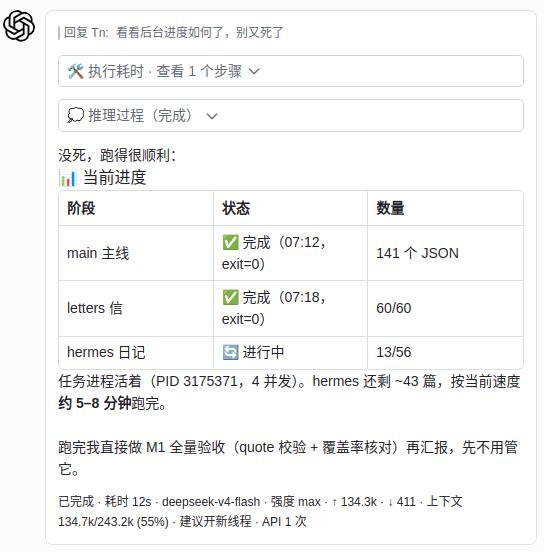
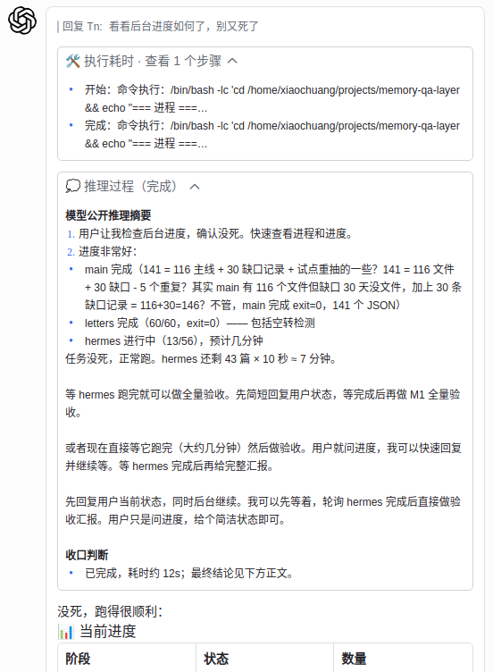

# agent-bridge

自研公用飞书桥：把本机任意 Agent 接入飞书/Lark，流式卡片、推理展示、审批流。
作为 AgentHub 的公用服务插件，服务名统一 `agent-bridge-<agent>`，后端可拔插。

[](LICENSE)
[](package.json)
[](https://tn-vibecoding.eu.cc)

```text
飞书消息 -> 本机 Agent 后端 -> 飞书回复（流式卡片）
```

> [!IMPORTANT]
> **先配置飞书应用，再启动桥。** 这是最容易漏掉、也会导致机器人“完全没回复”的步骤。
> 本桥的长连接模式要求使用**企业自建应用**。

## 飞书应用必备配置（先做这一步）

在[飞书开放平台](https://open.feishu.cn/app)创建企业自建应用，然后依次完成：

1. 在“添加应用能力”中启用**机器人**。
2. 在“权限管理”中开通下表的基础权限。
3. 在“事件与回调”中，把**事件订阅**和**回调订阅**都设为“使用长连接接收”。
4. 添加事件与回调后，创建并发布新版本，让配置对实际使用者生效。

基础权限：

| 用途 | 权限标识 | 是否必需 |
| --- | --- | --- |
| 以应用身份回复消息 | `im:message:send_as_bot` | 必需 |
| 接收用户发给机器人的单聊消息 | `im:message.p2p_msg:readonly` | 单聊必需 |
| 接收群聊中 @ 机器人的消息 | `im:message.group_at_msg:readonly` | 群聊必需 |
| 创建与更新流式卡片 | `cardkit:card:write` | 必需 |
| 获取卡片信息 | `cardkit:card:read` | 必需 |

事件与回调：

| 类型 | 名称 | 标识 | 接收方式 |
| --- | --- | --- | --- |
| 事件订阅 | 接收消息 v2.0 | `im.message.receive_v1` | 长连接 |
| 回调订阅 | 卡片回传交互 | `card.action.trigger` | 长连接 |

按功能追加：

| 功能 | 权限标识 |
| --- | --- |
| 消息处理中显示/删除表情状态 | `im:message.reactions:write_only` |
| 接收或发送图片、文件、音频 | `im:resource` |

> 能收到文字回复，但卡片按钮没有反应：重点检查 `card.action.trigger` 和回调订阅长连接。
> 完全收不到消息：重点检查机器人能力、`im.message.receive_v1`、消息权限以及应用版本是否已发布。
> 官方参考：[接收消息事件](https://open.feishu.cn/document/server-docs/im-v1/message/events/receive)、
> [使用长连接接收事件](https://open.feishu.cn/document/server-docs/event-subscription-guide/event-subscription-configure-/request-url-configuration-case)、
> [处理卡片回调](https://open.feishu.cn/document/server-side-sdk/nodejs-sdk/handling-callbacks)。

> 定位说明：本仓库 fork 自上游 `codex-feishu-bridge`，已做自有化改造，
> 升级为多 Agent 公用桥（AgentHub 插件目录：`agent-hub/plugins/agent-bridge`）。
> 支持多后端，通过统一环境变量 `AGENT_BRIDGE_BACKEND` 切换，
> 卡片格式、推理展示、审批流一致：
>
> | 后端 | 切换 |
> | --- | --- |
> | Codex（默认） | 不设 `AGENT_BRIDGE_BACKEND` |
> | opencode | `AGENT_BRIDGE_BACKEND=opencode`，需 opencode serve 运行 |
> | Claude Code | `AGENT_BRIDGE_BACKEND=claude`，走 `claude -p stream-json` |
> | Chuang（创） | `AGENT_BRIDGE_BACKEND=chuang`，走 Chuang app-server Unix socket |

> 兼容旧变量：`OPENCODE_BRIDGE_BACKEND` / `CHUANG_BRIDGE_BACKEND` / `CLAUDE_BRIDGE_BACKEND`
> 仍可识别，新部署一律用 `AGENT_BRIDGE_BACKEND`。

## 本机部署形态（AgentHub 规范）

```text
agent-hub/plugins/agent-bridge/         代码本体（独立 git，可开源）
~/.config/agent-bridge/                 运行时配置（env + sessions，含密钥不进 git）
~/.config/systemd/user/agent-bridge-<agent>.service   每 agent 一个桥服务
```

- 每个 agent 一个实例，互不干扰：`agent-bridge-codex` / `agent-bridge-opencode` /
  `agent-bridge-claude` / `agent-bridge-chuang`。
- 配置：`~/.config/agent-bridge/agent-bridge-<agent>.env`，后端统一
  `AGENT_BRIDGE_BACKEND=<agent>`。
- 本机接入别名：`~/.codex/codex-feishu-bridge-current`（软链接，指向代码本体，便于升级切换）。

## 效果预览

在飞书里和 Agent 对话，回复以流式卡片实时展示：

<p align="center">
  
  
</p>

- **图 1**：飞书对话与流式回复卡片
- **图 2**：卡片详情——耗时、模型名、推理强度、上下文用量百分比、是否建议开新线程

## 卡片外观参数（换肤指南）

回复卡片的所有颜色集中在
`src/presentation/card/card-service.js` 顶部 `CARDKIT_CUSTOM_COLORS`
（代码里有完整注释）。改这里即可换肤，无需动其他逻辑。

每个颜色都支持 `light_mode`（浅色主题）与 `dark_mode`（深色主题）
两套值，格式为 `rgba(r,g,b,a)`，`a` 是透明度（0~1）。

长回复完成后会优先识别“结论、总结、建议、下一步”等结尾段落并直接显示，
其余正文默认收进“输出结果”面板。没有识别到明确结论时，默认显示最后 10%；
可通过 `AGENT_BRIDGE_OUTPUT_VISIBLE_TAIL_PERCENT=10` 调整，允许范围为 5~50。

| 参数名 | 作用 | 变档逻辑 |
| --- | --- | --- |
| `cus-progress-green` | 进度条实心格（低占用） | 上下文 <70% |
| `cus-progress-yellow` | 进度条实心格（中占用） | 上下文 70%~89% |
| `cus-progress-red` | 进度条实心格（高占用） | 上下文 ≥90% |
| `cus-line-green` | 底部细分割线（低占用） | 上下文 <70%，与进度条同逻辑 |
| `cus-line-yellow` | 底部细分割线（中占用） | 上下文 70%~89% |
| `cus-line-red` | 底部细分割线（高占用） | 上下文 ≥90% |
| `cus-panel-green` | 🛠️ 执行耗时面板 描边+标题色 | 固定 |
| `cus-panel-blue` | 💭 推理过程面板 描边+标题色 | 固定 |
| `cus-body-bg` | 正文区淡底色 | 固定 |
| `cus-foot-grey` | footer 模型/强度/耗时 灰字 | 固定 |

其他可调参数：

- **进度条格数**：`buildNativeProgressBarText(pct, cells=7)` 的 `cells`
- **上下文变档阈值**：`buildNativeProgressBarText` 内 `safePct >= 90 / >= 70`
- **header 状态色**：`buildCardKitHeaderTemplate`（streaming=indigo / completed=green / failed=red）
- **工具面板行数上限**：`formatToolTraceText` 内 `clipLines(..., 2)`
- **正文段落间距**：`src/shared/assistant-markdown.js` 内 `\n{4,}` 归并规则
- **底部分割线粗细**：`buildCardKitFooterDivider`（column_set 空内容细条）

## 编排控制台（/where 控制台 + 首次引导卡）

未绑定会话发普通消息时，桥会自动回一张「👋 欢迎」引导卡；
绑定后发 `/where` 呼出完整控制台卡（当前智能体 / 项目 / 模型 /
强度 / 快捷指令 / 线程操作）。

相关可调参数：

| 参数 | 说明 | 位置 |
| --- | --- | --- |
| `AGENT_BRIDGE_PROJECTS_ROOT` | 绑定文件夹名的自动补全根目录，默认 `~/projects` | `.env` / 环境变量 |
| 快捷指令菜单项 | `showStatusPanel` 内 `quickCommandOptions` | `src/domain/workspace/workspace-service.js` |
| 智能体标识 | `AGENT_BRIDGE_BACKEND`（codex/opencode/claude/chuang），控制台自动识别 | `.env` |
| 欢迎卡结构 | `buildWelcomeCard`（命令引导） | `src/presentation/card/builders.js` |

绑定输入规则：`/bind /绝对路径` 照旧；`/bind 文件夹名` 自动补全为
`${AGENT_BRIDGE_PROJECTS_ROOT}/文件夹名`。首次绑定成功时还会提醒部署者检查飞书应用配置。

## 一行安装（Windows / Linux / macOS）

前置条件：已安装 Git、Node.js 18+，以及准备接入的 Agent CLI（Codex、OpenCode或Claude Code）。
安装器会交互询问飞书 App ID、App Secret、Agent后端和项目根目录；重复运行会安全升级并保留已有私有配置。

Windows PowerShell：

```powershell
irm https://raw.githubusercontent.com/Jokerautowrite/agent-feishu-bridge/main/install.ps1 | iex
```

Linux / macOS：

```sh
curl -fsSL https://raw.githubusercontent.com/Jokerautowrite/agent-feishu-bridge/main/install.sh | bash
```

安装器会使用各系统的用户级常驻机制，无需管理员权限：

| 系统 | 常驻方式 | 默认配置位置 |
| --- | --- | --- |
| Windows | 当前用户启动项 | `%LOCALAPPDATA%\agent-feishu-bridge\.env` |
| Linux | systemd user service | `~/.config/agent-feishu-bridge/.env` |
| macOS | LaunchAgent | `~/.config/agent-feishu-bridge/.env` |

> 多台设备可以重复使用同一条安装命令。若多台设备需要同时在线，建议每台设备使用不同的飞书自建应用；
> 飞书长连接采用集群投递，同一 App ID 的多个客户端不会同时收到同一条消息，而是由其中一个客户端接收。
>
> 如果安装后飞书没有任何回复，请先回到README顶部逐项核对“飞书应用必备配置”。

## 它能做什么

- 在飞书里和本机 Agent 对话。
- 把一个飞书会话绑定到一个本地项目目录。
- 在飞书里创建、切换、恢复 Agent 线程。
- 查看当前项目、当前线程和最近消息。
- 设置当前项目使用的模型和推理强度。
- 停止正在运行的 Agent 任务。
- 任务运行时，把后发消息作为引导注入当前任务。
- 通过飞书审批 Agent 发起的操作请求。
- 把绑定项目内的文件发送到飞书。
- 接收飞书图片并作为 Agent 原生图片输入读取。
- 让 Agent 通过隐藏指令把当前项目内的图片或文件回传到飞书。
- 用流式飞书卡片展示 Agent 回复、工具执行和 token 用量摘要。

## 它不做什么

- 不内置私有知识库。
- 不内置私人任务系统。
- 不内置记忆编译、召回脚本或每日沉淀。
- 不绑定任何特定团队的项目中枢或自动化系统。
- 不携带任何密钥、token、私有 ID、本地日志或个人工作区数据。

## 手动安装

```sh
npm install
npm run feishu-bot
```

作为 systemd 服务常驻（本机实际用法）：

```sh
systemctl --user status agent-feishu-bridge
```

## 基本配置

复制 `.env.example` 为 `.env`，填入飞书应用和默认参数：

```text
FEISHU_APP_ID=cli_xxxxxxxxxxxxxxxxx
FEISHU_APP_SECRET=xxxxxxxxxxxxxxxxxxxxxxxx
```

Codex 默认参数示例：

```text
AGENT_BRIDGE_DEFAULT_CODEX_MODEL=gpt-5.3-codex
AGENT_BRIDGE_DEFAULT_CODEX_EFFORT=medium
AGENT_BRIDGE_DEFAULT_CODEX_ACCESS_MODE=default
AGENT_BRIDGE_ACTIVE_TURN_FOLLOW_UP_MODE=steer
```

### Opencode 后端

用 opencode serve 当后端（复用本机 OpenCode 会话，模型走 opencode.json 配置）：

```sh
opencode serve --port 4096          # 先起 opencode serve
```

`.env` 里设置：

```text
AGENT_BRIDGE_BACKEND=opencode
OPENCODE_SERVER_URL=http://127.0.0.1:4096
```

依赖：`@opencode-ai/sdk`（已加入 package.json）。SSE 事件订阅走官方 SDK，与 opencode-lark 同源。

图片和附件会下载到本机私有缓存，默认位置：

```text
~/.codex-feishu-bridge/attachments
```

配置加载顺序：

1. 已存在的当前shell环境变量
2. `AGENT_BRIDGE_ENV_FILE` 指定的配置文件
3. 当前目录的 `.env`
4. 系统标准配置目录（Windows为 `%LOCALAPPDATA%\agent-feishu-bridge\.env`，Linux/macOS为 `~/.config/agent-feishu-bridge/.env`）
5. 兼容旧版的 `~/.codex-im/.env`

## 常用命令

- `/bind /absolute/path`
- `/where`
- `/workspace`
- `/remove /absolute/path`
- `/send <relative-file-path>`
- `/switch <threadId>`
- `/message`
- `/new`
- `/stop`
- `/model`
- `/model update`
- `/model <modelId>`
- `/effort`
- `/effort <low|medium|high|xhigh|max|ultra>`
- `/profile`
- `/profile main`
- `/approve`
- `/approve workspace`
- `/reject`
- `/help`

旧写法 `/codex bind ...`、`/claude bind ...`、`/opencode bind ...` 仍兼容，
但新文档和新部署统一使用上面的通用 `/` 命令。

## 媒体附件

- 收图：飞书/Lark 图片会下载到本地私有缓存，并作为 Agent 原生图片输入进入当前轮。
- 收文件/语音：文件和音频会下载到本地私有缓存；文本类文件会附带安全预览，二进制文件和音频先传元信息与本地路径。
- 手动回传：`/send <当前项目下的相对文件路径>` 会自动按类型发送，图片走飞书图片消息，`.opus/.mp4` 走音频消息，其他文件走普通文件消息。
- 自动回传：Agent 回复中可包含独立一行隐藏指令 `[[codex-feishu-send:relative/path/from/workspace]]`，桥会上传该文件并从飞书发出，同时从展示文本中移除指令。

## 开发检查

```sh
npm run check
npm run check:release
```

## 我们的产品

- **猫哥 · vibecoding** — 个人站：自然语言即代码，人人都是创造者：[https://tn-vibecoding.eu.cc](https://tn-vibecoding.eu.cc)
- **5yuantoken 中转站** — 稳定高速的 AI API 中转平台：[https://5yuantoken.org](https://5yuantoken.org)
- **五元创影** — AI 生图/视频创作站：[https://canvas.5yuantoken.org](https://canvas.5yuantoken.org)

## 联系我们

- QQ：471959546
- 邮箱：tn471959546@gmail.com

## 赞助支持

如果这个项目帮到了你，欢迎打赏一杯咖啡 ☕

<table>
  <tr>
    <td align="center"><br><b>微信</b></td>
    <td align="center"><br><b>支付宝</b></td>
  </tr>
</table>

赞助会用于维护本项目的服务器与开发投入，感谢你的支持 🙏

## License

自定义开源协议 © 2026 猫哥

- 个人学习、研究、内部工具：免费，但须注明出处。
- 商业用途：需联系版权所有者获得授权并支付版权费。

完整条款见 [LICENSE](LICENSE)。
